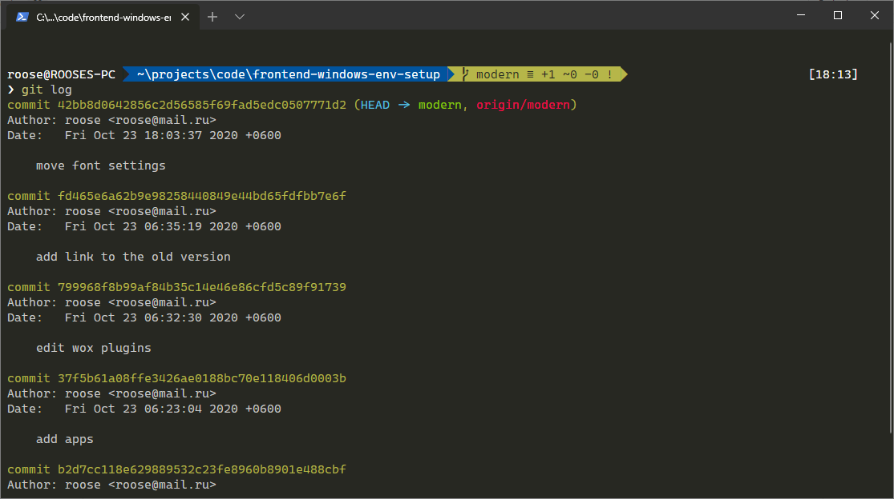
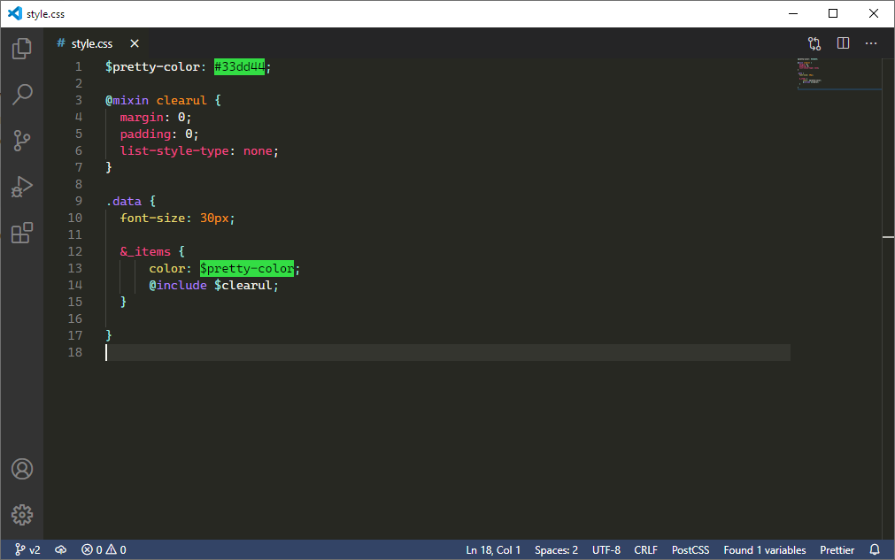
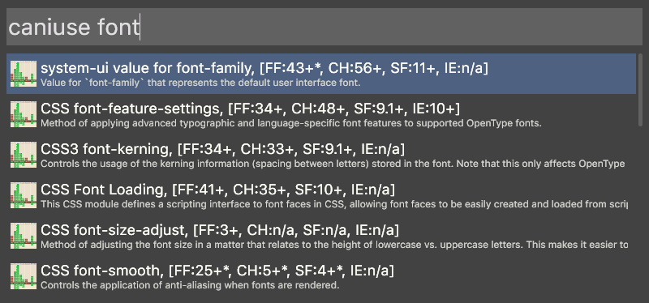

# Настройка рабочего окружения фронтенд разработчика на Windows

**Внимание**: это новая версия, старая версия [тут](https://github.com/roose/frontend-windows-env-setup/blob/1.0.0/README.md)

- [scoop](#scoop)
- [Консоль](#%D0%9A%D0%BE%D0%BD%D1%81%D0%BE%D0%BB%D1%8C)
- [Git](#git)
- [Node.js](#nodejs)
- [Wox](#wox)
- [Другие программы и инструменты](#%D0%94%D1%80%D1%83%D0%B3%D0%B8%D0%B5-%D0%BF%D1%80%D0%BE%D0%B3%D1%80%D0%B0%D0%BC%D0%BC%D1%8B-%D0%B8-%D0%B8%D0%BD%D1%81%D1%82%D1%80%D1%83%D0%BC%D0%B5%D0%BD%D1%82%D1%8B)
- [Папка проектов](#Папка проектов)

## scoop

[scoop](https://scoop.sh/) — это установщик программ из командной строки.

### Установка
Открыть PowerShell и выполнить сперва:
```powershell
Set-ExecutionPolicy RemoteSigned -scope CurrentUser
```
а потом:
```powershell
Invoke-Expression (New-Object System.Net.WebClient).DownloadString('https://get.scoop.sh')
```

### Использование

Для установки программы выполните:
```powershell
scoop install <app>
```
Чтобы узнать, нужно ли обновить одну из установленных программ:
```powershell
scoop status
```
Чтобы обновить программу:
```powershell
scoop update <app>
```
Можно поискать программу:
```powershell
scoop search <app>
```
scoop сохраняет все скачанное в кэше, удаление кэша:
```powershell
scoop cache # посмотреть кэш
scoop cache rm <app> # удалить кэш определенной программы
scoop cache rm * # удалить весь кэш
```
scoop сохраняет не удаляет сам старые версии(вдруг вам придется откатиться), удаление старых версий:
```powershell
scoop cleanup <app> # удалить старые версии определенной программы
scoop cleanup * # удалить старые версии всех программ
```

## Консоль
Первое что вы должны установить после того как разберётесь со **scoop** — это терминал, мы будем использовать **Windows Terminal**:
```powershell
scoop install windows-terminal
```

### Настройка консоли, алиасы, функции

Далее настройка терминала, на сайте https://windowsterminalthemes.dev/ выберите подходящую тему, откройте файл настройки терминала(<kbd>Ctrl</kbd>+<kbd>,</kbd> или в выпадающем меню выбрать `Settings`) докрутить до `schemes` и добавить тему выбранную на сайте тему.

Далее необходимо установить шрифт `Cascadia Code PL` это можно сделать добавив `bucket` `nerd-fonts` в `scoop`(`bucket` это репозиторий с манифестами программ, у `scoop` есть дефолтные репозитории с манифестами, но вы можете установить сторонние или создать свои):
```powershell
scoop bucket add nerd-fonts
```
а потом установить шрифт:
```powershell
scoop install Cascadia-Code
```
Заново открыв файл настройки **Windows Terminal**, найдите профиль **Windows PowerShell** и добавьте `"fontFace": "Cascadia Code PL"`

Этот шрифт нужен для нормального отображения приглашения `oh-my-posh`, устанавливаем `oh-my-posh`(и заодно `posh-git`):
```powershell
Install-Module posh-git -Scope CurrentUser
Install-Module oh-my-posh -Scope CurrentUser
```
Откройте профиль **PowerShell** с помощью `notepad $PROFILE`(или любого другого текстового редактора) и добавьте туда:
```powershell
Import-Module posh-git
Import-Module oh-my-posh
Set-Theme Paradox
```
`$PROFILE` это профиль **PowerShell**, не **Windows Terminal**



## Редактор кода
**Visual Studio Code** — редактор исходного кода, разработанный Microsoft, имеет широкие возможности для кастомизации: пользовательские темы, сочетания клавиш и файлы конфигурации. Распространяется бесплатно, разрабатывается как программное обеспечение с открытым исходным кодом, установка:
```powershell
scoop install vscode
```
Список рекомендуемых расширений:
- Bracket Pair Colorizer 2 — подсветка пар скобок
- Colorize — визуализация названий/значений цветов, например `red` будет выделен красным цветом
- Debugger for Firefox/Chrome — дебаггер для Firefox/Chrome
- Diff — расширения для сравнения файлов
- EditorConfig for Visual Studio Code — расширения для `.editorconfig` файлов
- HTML CSS Support — недостающие CSS фичи, дополнения классов и т.д.
- Markdown All in One — предпросмотр md файлов
- Npm Intellisense — дополнение `npm` модулей
- Path Intellisense — дополнение путей
- PostCSS Language Support — поддержка `PostCSS` синтаксиса
- Prettier - Code formatter — форматирование кода
- SVG Viewer — предпросмотр SVG файлов



## Git

[Git](https://ru.wikipedia.org/wiki/Git) — это легкая в использовании система управления файлами, даже если вы **пока** не используете Git, после установки вам будет доступны некоторые linux команды в консоли. Для работы с git обычно используют [GitHub](http://github.com). GitHub предлагает свой [GUI клиент](https://windows.github.com/) для работы с git. После установки клиента, вам будет доступны так же и инструменты для работы с git из командной строки. Бесплатная книга по git — [Pro Git](http://git-scm.com/book/ru/v2) на русском.

Установка:
```powershell
scoop install git
```

## Node.js

[Node.js](https://nodejs.org) — это среда для выполнения JavaScript. Обычно это среда для выполнения JavaScript на сервере, но так как мы фронтенд разработчики, мы будем использовать его для повышения эффективности своей работы, а также для ее упрощения.

Установка(если вам нужны разные версии ноды то установите `scoop install nvm` и далее меняйте версию ноды через него):
```powershell
scoop install nodejs # последняя версия nodejs
```

### Пакеты node.js — npm

[npm](http://npmjs.com) — это менеджер пакетов для node.js, устанавливается вместе с nodejs

### Пакеты node.js — yarn
[yarn](https://yarnpkg.com/lang/en/) — это альтернативный менеджер пакетов для node.js

Установка:
```powershell
scoop install yarn
```

## Wox

[Wox](http://getwox.com) — лаунчер, который поможет нам в разработке и сделает ее проще и эффективней. Запускается сочетанием клавиш <kbd>Alt</kbd><kbd>Space</kbd>, можно настроить на другое сочетание клавиш.

### Плагины Wox
Плагины устанавливаются в самом Wox'e, просто напишите `wpm install <app>`

- [CanIUse](https://github.com/roose/Wox.Plugin.CanIUse) — проверка поддержки технологий на сайте caniuse.com `wpm install caniuse`
- [FileZilla](https://github.com/roose/Wox.Plugin.OpenInFileZilla) — быстрое открытие сайта в FileZilla `wpm install filezilla`
- [npm search](https://github.com/roose/wox-npms-search) — поиск модулей npm, ручная установка, скачать релиз и перетащить в окно Wox
- [PostCSS Search](https://github.com/roose/wox-postcss-search) — поиск модулей PostCSS, ручная установка, скачать релиз и перетащить в окно Wox
- [StackOverlow](https://github.com/amalyushko/Wox.Plugin.StackOverlow) - поиск вопросов Stack Overflow. `wpm install stack overflow`
- [Github](https://github.com/JohnTheGr8/Wox.Plugin.Github) - поиск github репозиториев, пользователей, просмотр ишью и пулл реквестов `wpm install github`



## Другие программы и инструменты
- [Firefox](https://www.mozilla.org/ru/firefox/new/) — браузер Firefox `scoop install firefox` или `scoop install firefox-developer` 
- [Chrome](https://www.google.com/intl/ru/chrome/) — браузер Chrome `scoop install googlechrome` или `scoop install googlechrome-canary` 
- [FileZilla](https://filezilla-project.org/) — FTP клиент `scoop install filezilla` 
- [bat](https://github.com/sharkdp/bat) — клон `cat` с подсветкой синтаксиса и интеграцией с Git `scoop install bat` 
- [devdocs](https://github.com/egoist/devdocs-desktop) — Десктопная версия сайта DevDocs.io `scoop install devdocs` 
- [gsudo](https://github.com/gerardog/gsudo) — sudo для Windows `scoop install gsudo` 
- [insomnia](https://insomnia.rest/) — REST Client для тестирования и проектирования REST API `scoop install insomnia` 
- [jpegtran](https://ruhighload.com/jpegtran) — JPEG кодировщик `scoop install mozjpeg` 
- [notion](https://www.notion.so/) — приложение, которое предоставляет такие компоненты, как базы данных, доски канбан, вики, календари и напоминания. `scoop install notion` 
- [optipng](http://optipng.sourceforge.net/) — PNG оптимизатор `scoop install devdocs` 
- [scoop-completion](https://github.com/Moeologist/scoop-completion) — дополнение `scoop` команд в терминале `scoop install scoop-completion` 
- [stretchly](https://hovancik.net/stretchly/) — Напоминает о необходимости перерывов `scoop install stretchly` 
- [touch](https://github.com/lukesampson/psutils) — создание файлов в терминале `scoop install touch` 
- [typora](https://typora.io/) — редактор markdown файлов `scoop install typora` 
- [win-cli](https://github.com/roose/win-cli) — полезная тулза для Windows терминала `scoop install win-cli` 

## Папка проектов

Рекомендую создать папку `~\projects` и там хранить все свои проекты, можете как я разделить их дополнительно на `~\projects\code` и `~\projects\sandbox`, все эксперименты, располагать в папке `~\projects\sandbox`, а если эти эксперименты станут достойны того чтобы разместить их на github, то переносите их в `~\projects\code`. 